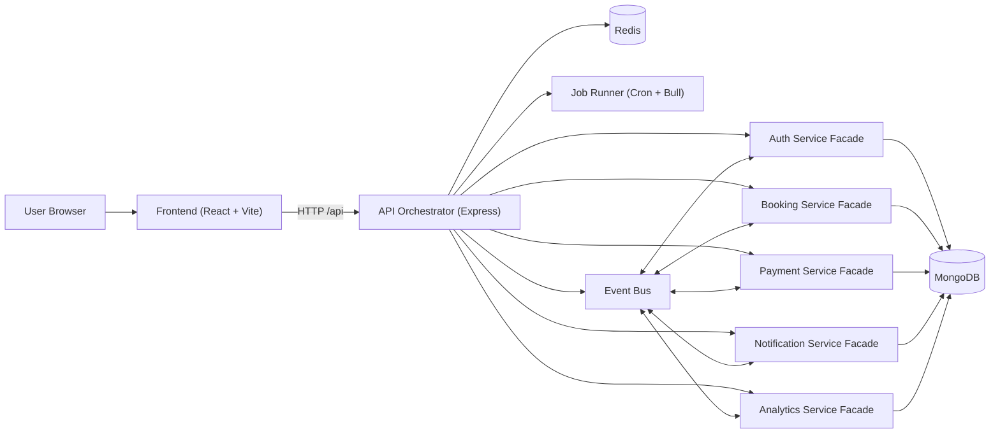

# TravAgent - B2B Travel Operations Platform

Production-style full-stack platform for travel agencies with secure RBAC, workflow automation, Redis-backed caching, background jobs, and event-driven service orchestration.

## Executive Summary

TravAgent is a backend-heavy business platform designed around operational control and role safety:

- Multi-role agent management with strict hierarchy enforcement.
- Domain modules for bookings, customers, itineraries, leads, payments, commissions, notifications, and audits.
- Dynamic DB-backed permissions (with Redis cache and hardcoded fallback).
- Simulated microservice orchestration via service facades + internal event bus.
- Background processing using cron + Bull queues.
- React + TypeScript admin console with permission-driven navigation and performance optimizations.

This repository is a **hybrid monolith**: one deployable backend runtime, but architected with service boundaries and event-driven contracts to support future extraction.

---

## System Architecture



### Runtime Components

- **Orchestrator**: `backend/server.js`
  - Loads middleware, mounts service facades, initializes Redis/Cloudinary/jobs, exposes health diagnostics.
- **Service Registry**: `backend/shared/serviceRegistry.js`
  - Tracks registered service modules and runs service-level health checks.
- **Event Bus**: `backend/shared/eventBus.js`
  - In-process pub/sub used for cross-domain workflows (booking -> payment -> notification/analytics).
- **Background Jobs**: `backend/jobs/index.js`
  - Starts cron tasks and Bull processors, reports job health in `/api/health`.

---

## Technology Stack

### Backend

| Layer | Technology |
|---|---|
| Runtime | Node.js |
| HTTP Server | Express |
| Data Layer | MongoDB + Mongoose |
| Cache | Redis (`ioredis`) |
| Queueing | Bull |
| Scheduling | node-cron |
| Auth | JWT + bcrypt |
| Validation | express-validator |
| Security | helmet, cors, express-rate-limit |
| File Upload | multer + Cloudinary storage adapter |

### Frontend

| Layer | Technology |
|---|---|
| UI | React 19 |
| Language | TypeScript |
| Build Tool | Vite 7 |
| Styling | Tailwind CSS 4 |
| Charts | Recharts |
| HTTP Client | Axios |
| UX Utilities | react-hot-toast, lucide-react |

---

## Role Hierarchy and RBAC

Canonical role source: `backend/config/role.js`

### Hierarchy

| Role | Level |
|---|---:|
| `super_admin` | 5 |
| `admin` | 4 |
| `senior_agent` | 3 |
| `agent` | 2 |
| `junior_agent` | 1 |

### Role Creation/Promotion Matrix

| Acting Role | Allowed Targets |
|---|---|
| `super_admin` | `admin`, `senior_agent`, `agent`, `junior_agent` |
| `admin` | `senior_agent`, `agent`, `junior_agent` |
| `senior_agent` | `agent`, `junior_agent` |
| `agent` | none |
| `junior_agent` | none |

### Critical Security Rules

- Public signup is hard-forced to `agent` (`backend/services/authService.js`).
- Super admin cannot be created through API signup.
- JWT role is never trusted blindly; backend fetches fresh role from DB on each protected request (`backend/middleware/auth.js`).
- Permission checks are dynamic and async (`backend/middleware/roleCheck.js` + `backend/services/permissionService.js`).

### Dynamic Permission Engine

- Permission model: `backend/models/Permission.js`
- Endpoints:
  - `GET /api/permissions`
  - `GET /api/permissions/me`
  - `GET /api/permissions/:role`
  - `PUT /api/permissions/:role`
  - `POST /api/permissions/reset`
- Redis cache key prefix: `permissions:<role>`
- Fallback behavior: if DB/cache check fails, hardcoded permission map is used.

---

## Core Domain Modules

### Auth and Agent Governance

- Registration, login, refresh token, password change, logout.
- Approval workflow (`pending -> approved/rejected`).
- Admin/super-admin agent approvals and role transitions.
- Team assignment for senior-agent workflows.

### Customer and Booking Operations

- Customer lifecycle with ownership-aware access.
- Booking lifecycle and status history.
- Conflict-aware booking indexing.
- Booking/customer file attachment support via uploads.

### Lead Pipeline

- Lead intake, status progression, follow-ups, assignment.
- Conversion endpoint to booking.
- Auto stale-lead cleanup job.

### Payments and Commissions

- Payment processing and refunds.
- Commission generation and payout flow:
  - `pending -> approved -> paid`
- Role-gated approval and payout actions.

### Notifications and Auditing

- In-app notifications with optional simulated email dispatch.
- Audit logs for critical and operational actions.
- Admin-access audit analytics and filtering.

### Analytics and Dashboard

- Dashboard KPIs and recent activity.
- Analytics overview + admin-level detail endpoints.
- Daily snapshot cron for historical trending.

---

## Event-Driven Workflow Examples

Published/subscribed events are defined in `backend/shared/eventBus.js`.

### Booking Confirmation -> Commission

1. Booking domain emits `BOOKING_CONFIRMED`.
2. Payment service subscription checks for existing commission.
3. Commission is created via `commissionService`.
4. Cache invalidation and notifications are triggered by downstream actions.

### Payment Completion -> Status + Notification + Analytics

1. Payment domain emits `PAYMENT_COMPLETED`.
2. Booking service subscription updates booking payment state.
3. Notification service subscription sends in-app/email messages.
4. Analytics service subscription records tracking event.

---

## API Design and Contracts

### Base URL

- Backend base: `http://localhost:<PORT>/api`
- Frontend default expects: `VITE_BACKEND_URL=http://localhost:5001`

### Standard Response Envelope

Defined in `backend/utils/apiResponse.js`:

```json
{
  "success": true,
  "message": "Success",
  "data": {},
  "timestamp": "2026-02-15T00:00:00.000Z"
}
```

Paginated responses include:

```json
{
  "success": true,
  "count": 10,
  "pagination": {
    "currentPage": 1,
    "totalPages": 5,
    "totalRecords": 50,
    "limit": 10
  },
  "data": []
}
```

### High-Value Endpoint Groups

- `auth`: `/api/auth/*`
- `agents`: `/api/agents/*`
- `customers`: `/api/customers/*`
- `bookings`: `/api/bookings/*`
- `itineraries`: `/api/itineraries/*`
- `leads`: `/api/leads/*`
- `payments`: `/api/payments/*`
- `commissions`: `/api/commissions/*`
- `notifications`: `/api/notifications/*`
- `dashboard`: `/api/dashboard/*`
- `analytics`: `/api/dashboard/analytics/*`
- `audit`: `/api/audit-logs/*`
- `uploads`: `/api/uploads/*`
- `permissions`: `/api/permissions/*`
- `cache admin`: `/api/cache/*`
- `ops diagnostics`: `/api/health`, `/api/events/log`

---

## Caching Strategy (Redis)

### What is Cached

Implemented via `backend/middleware/cache.js` and `backend/services/cacheService.js`:

- List endpoints and dashboard/analytics endpoints.
- Cache keys include: endpoint prefix + agent id + normalized query string.

### TTL Profiles

- `SHORT`: 120s
- `MEDIUM`: 300s
- `LONG`: 600s
- `AGENT_STATS`: 180s

### Invalidation

Pattern-based invalidation map by resource type:

- `booking`, `lead`, `payment`, `customer`, `commission`, `agent`, `itinerary`

### Debug Signals

Cached responses include headers:

- `X-Cache: HIT|MISS`
- `X-Cache-Key: ...`

### Graceful Degradation

If Redis is unavailable or disabled (`CACHE_ENABLED=false`), API continues without cache.

---

## Background Jobs and Queues

Job bootstrap: `backend/jobs/index.js`

### Cron Jobs

| Job | Schedule | Timezone | Purpose |
|---|---|---|---|
| Booking Reminder | `0 9 * * *` | `Asia/Kolkata` | Notify upcoming trips (7-day window). |
| Stale Lead Cleanup | `0 0 * * *` | `Asia/Kolkata` | Auto-close inactive leads. |
| Commission Calc | `0 * * * *` | `Asia/Kolkata` | Create missing commissions for eligible bookings. |
| Daily Snapshot | `0 23 * * *` | `Asia/Kolkata` | Persist daily aggregate stats. |

### Bull Queues

- `email-queue` -> `jobs/processors/emailProcessor.js`
- `report-queue` -> `jobs/processors/reportProcessor.js`

If Redis queue is unavailable, email path falls back to synchronous simulation.

---

## Data Model Map

Mongoose models (`backend/models`, 11 total):

- `Agent`
- `Permission`
- `Customer`
- `Booking`
- `Lead`
- `Payment`
- `Commission`
- `Itinerary`
- `Notification`
- `AuditLog`
- `Document`

### Notable Schema Characteristics

- Indexing for search and conflict detection (e.g., bookings and leads).
- Lifecycle status enums across booking/payment/lead/commission.
- Reference-driven associations across all business entities.
- `Document.linkedTo` polymorphic relation for file attachment by model and id.

---

## Frontend Architecture

Frontend code: `frontend/src`

### UI Composition

- App shell and page orchestration: `frontend/src/App.tsx`
- Layout and permission-driven nav: `frontend/src/components/Layout.tsx`
- Auth + permission bootstrap context: `frontend/src/context/AuthContext.tsx`
- API client adapters: `frontend/src/services/*.ts`

### Implemented Pages (15)

- Dashboard
- Customers
- Bookings
- Itineraries
- Leads
- Payments
- Commissions
- Notifications
- Audit Logs
- Admin Settings
- Agent Approvals
- Permission Matrix
- Login
- Register
- Pending Approval

### Performance Patterns in Current Build

- Route-level lazy loading in `App.tsx`.
- Delayed skeleton rendering (`useDelayedLoading`) to avoid flicker on fast responses.
- Debounced search (`useDebouncedValue`) on data-heavy pages.
- Vite chunking for chart bundle separation (`recharts` split chunk).

---

## Security Controls

- `helmet` hardened headers.
- CORS configured via `CLIENT_URL`.
- Global and auth-specific rate limits.
- Request validation with `express-validator`.
- Centralized error normalization.
- Audit trails for critical state transitions.
- Ownership and hierarchy checks in role middleware.

---

## Repository Structure

```text
travel/
|- backend/
|  |- config/                 # DB, Redis, Cloudinary, role config
|  |- controllers/            # HTTP handlers
|  |- middleware/             # Auth, RBAC, cache, upload, validation, errors
|  |- models/                 # Mongoose schemas
|  |- routes/                 # API route definitions
|  |- services/               # Domain services + facades
|  |- shared/                 # eventBus + serviceRegistry
|  |- jobs/                   # cron, queues, processors
|  |- scripts/                # migration + regression/smoke suites
|  |- seeders/                # bootstrapping data
|  `- server.js               # orchestrator entrypoint
|- frontend/
|  |- src/components/         # reusable UI
|  |- src/context/            # auth and permission state
|  |- src/hooks/              # debounced and delayed loading hooks
|  |- src/pages/              # application views
|  |- src/services/           # API integrations
|  |- src/types/              # TS contracts
|  |- src/App.tsx             # app composition + lazy routing
|  `- vite.config.ts          # bundling strategy
`- README.md
```

---

## Local Development

### Prerequisites

- Node.js 18+
- MongoDB (local or Atlas)
- Redis (recommended; app can run without it)

### 1) Backend Setup

```bash
cd backend
npm install
```

Create `.env`:

```env
NODE_ENV=development
PORT=5001
CLIENT_URL=http://localhost:5173

MONGO_URI=mongodb://localhost:27017/travel

JWT_SECRET=change_me
JWT_EXPIRE=7d
JWT_REFRESH_SECRET=change_me_refresh
JWT_REFRESH_EXPIRE=30d

REDIS_URL=redis://localhost:6379
CACHE_ENABLED=true

CLOUDINARY_CLOUD_NAME=
CLOUDINARY_API_KEY=
CLOUDINARY_API_SECRET=

COMMISSION_RATE_DEFAULT=10
PAYMENT_GATEWAY_KEY=
```

Boot backend:

```bash
npm run dev
```

Seeders:

```bash
npm run create-super-admin
npm run seed
```

### 2) Frontend Setup

```bash
cd frontend
npm install
npm run dev
```

Frontend environment (`frontend/.env` optional):

```env
VITE_BACKEND_URL=http://localhost:5001
```

---

## Scripts

### Backend (`backend/package.json`)

- `npm run dev` - start API in watch mode
- `npm start` - start API
- `npm run seed` - seed baseline sample data
- `npm run create-super-admin` - bootstrap super admin account
- `npm run migrate:permissions` - normalize legacy permission keys
- `npm run test:rbac-regression` - RBAC regression checks
- `npm run test:frontend-smoke` - critical FE/API contract smoke checks

### Frontend (`frontend/package.json`)

- `npm run dev` - start Vite dev server
- `npm run build` - production build
- `npm run preview` - preview production build locally

### Additional Utility Scripts

Located in `backend/scripts`:

- `test-api.js`
- `test-rbac.js`
- `test-comprehensive.js`
- `test-steps-7-10.js`

---

## QA and Validation Strategy

Current suite includes:

- RBAC negative and positive path checks.
- Frontend-critical API contract checks:
  - login payload shape
  - permissions bootstrap (`/permissions/me`)
  - upload contract (`linkedModel`, `linkedId`)
  - filter parameter wiring for bookings/leads
- End-to-end style endpoint sweeps for operations sanity.

For CI hardening, recommended next step is converting script-based checks into a formal test runner and adding deterministic test fixtures.

---

## Operational Diagnostics

### Health Endpoint

`GET /api/health` reports:

- service registry summary + service health
- redis connectivity state
- job subsystem state
- event bus subscriptions + recent events

### Cache Admin Endpoints

- `GET /api/cache/status`
- `POST /api/cache/flush`
- `POST /api/cache/invalidate/:resource`

These routes require `canManageSettings` permission.

---

## Default Credentials (Seeded)

From seeders:

- Super Admin: `superadmin@travelplatform.com` / `SuperAdmin@123456`
- Admin: `admin@travelplatform.com` / `Admin@123456`
- Senior Agent: `rahul@travelagency.com` / `Agent@123456`
- Agent: `priya@travelagency.com` / `Agent@123456`

Change credentials immediately after bootstrapping in shared or remote environments.

---

## Design Intent

This codebase is optimized for **business rule integrity and extensibility** over demo-level simplicity:

- Explicit role and permission contracts.
- Strong auditability around critical changes.
- Service boundaries ready for future decomposition.
- Practical reliability patterns (cache fallback, queue fallback, delayed skeleton UX).

If you are evaluating this repository, focus on:

1. RBAC correctness and hierarchy enforcement.
2. API contract consistency (`response.data.data` shape and pagination envelope).
3. Decoupling strategy (service facades + event bus).
4. Operational resilience under partial dependency outages.
